# AWS 클라우드 환경에서 DDoS 유사 트래픽에 대한 웹 서비스 가용성과 인프라 기반 방어 효과 분석

## A. 프로젝트 명

**AWS 클라우드 환경에서 DDoS 트래픽에 대한 웹 서비스 가용성과 인프라 기반 방어 효과를 분석하는 프로젝트**

---

## B. 프로젝트 멤버 이름 및 멤버 별 담당한 파트 소개

| 이름 | 담당 역할 | 세부 담당 내용 |
|---|---|---|
| 김도환 | AWS 인프라 구축 | EC2 인스턴스 생성, Application Load Balancer 구성, Auto Scaling Group 설정, CloudWatch 지표 확인, 서버 이미지 기반 확장 환경 구성 |
| 김세엽(팀장) | 더미 웹 서버 및 부하 발생 기능 구현 | 실험 대상 더미 웹 서버 구축, 부하 발생 서버 구현, RPS 및 요청 부하 조절 기능 구현, 서버 구축 보조 |
| 전상현 | 실험 설계 및 보고서 작성 | 실험 시나리오 정리, Phase별 결과 분석, CloudWatch 지표 해석, 선행기술 조사, 최종 보고서 작성 |

---

## C. 프로젝트 소개

본 프로젝트는 AWS 클라우드 환경에서 실험용 웹 서비스를 구축하고, DDoS HTTP 트래픽이 발생했을 때 웹 서버의 부하와 서비스 가용성이 어떻게 변화하는지 분석하는 프로젝트이다. 이를 위해 부하 발생 서버, 더미 웹 서버, Application Load Balancer, Auto Scaling Group, CloudWatch를 구성하고, 트래픽 증가 상황에서 CPU 사용률, 응답 지연 시간, 요청 성공률과 실패율, 인스턴스 수 변화 등을 관측하였다.

프로젝트는 단일 인스턴스 구조, 로드밸런서를 이용한 정적 분산 구조, Auto Scaling을 이용한 동적 확장 구조를 단계적으로 비교하는 방식으로 진행하였다. 또한 Auto Scaling의 확장 및 축소 정책에 의해 인스턴스 수가 반복적으로 증가하고 감소하는 요요 현상도 별도로 관측하였다. 이를 통해 클라우드 환경에서 로드밸런싱과 오토스케일링이 서비스 가용성 유지에 어떤 효과를 가지는지 실험적으로 확인하였다.

---

## D. 프로젝트 필요성 소개

최근 대부분의 웹 서비스는 클라우드 환경을 기반으로 운영되고 있으며, 사용자 수 증가나 이벤트성 트래픽, DDoS와 같은 비정상적인 트래픽 증가 상황에 대비해야 한다. 단일 서버 구조에서는 많은 요청이 한 인스턴스에 집중되면 CPU 사용률이 급격히 증가하고, 응답 지연이나 오류가 발생할 수 있다. 이러한 구조에서는 해당 서버가 장애를 일으킬 경우 전체 서비스가 중단되는 단일 장애점(Single Point of Failure, SPOF) 문제가 발생한다.

따라서 클라우드 환경에서는 단순히 서버를 한 대 구축하는 것보다, 트래픽을 여러 서버로 분산하는 로드밸런싱 구조와 트래픽 변화에 따라 서버 수를 자동으로 조절하는 오토스케일링 구조가 필요하다. 본 프로젝트는 이러한 클라우드 인프라 기술이 실제 고부하 트래픽 상황에서 어떻게 동작하는지 직접 실험하고, 각 구조의 장점과 한계를 분석하기 위해 수행되었다.

특히 본 프로젝트는 단일 서버 구조와 분산 처리 구조를 수치적으로 비교함으로써, 클라우드 기반 웹 서비스에서 가용성 확보가 왜 중요한지 보여준다. 또한 오토스케일링의 경우 트래픽 증가에 따라 서버를 자동으로 늘리고, 트래픽 감소 후 다시 줄이는 탄력성을 제공하지만, 설정에 따라 스케일링 지연이나 요요 현상이 발생할 수 있음을 관측하였다. 이를 통해 클라우드 서비스 운영 시 성능, 가용성, 비용 최적화를 함께 고려해야 함을 확인할 수 있다.

---

## E. 관련 기술/논문/특허 조사 내용 소개

관련된 기술은 클라우드 기반 DDoS 대응, 로드밸런싱, 오토스케일링, 모니터링, 부하 테스트 도구 등으로 구분할 수 있다.

### 1. AWS Elastic Load Balancing

AWS Elastic Load Balancing은 들어오는 애플리케이션 트래픽을 여러 EC2 인스턴스, 컨테이너, IP 주소 등 여러 대상으로 자동 분산하는 서비스이다. 본 프로젝트에서는 Application Load Balancer를 사용하여 하나의 웹 서버에 집중되는 요청을 여러 EC2 인스턴스로 분산하였다. 이를 통해 단일 서버 구조와 다중 서버 분산 구조의 성능 차이를 비교하였다.

출처: https://docs.aws.amazon.com/elasticloadbalancing/latest/userguide/what-is-load-balancing.html

### 2. Amazon EC2 Auto Scaling

Amazon EC2 Auto Scaling은 애플리케이션 부하에 맞게 적절한 수의 EC2 인스턴스를 유지하도록 지원하는 서비스이다. 사용자는 최소 인스턴스 수, 최대 인스턴스 수, 원하는 인스턴스 수를 설정할 수 있으며, CPU 사용률 등의 지표를 기준으로 Scale-out과 Scale-in 정책을 적용할 수 있다. 본 프로젝트에서는 CPU 사용률을 기준으로 인스턴스 수가 1대에서 5대까지 증가하고, 부하 종료 후 다시 1대로 감소하는 과정을 관측하였다.

출처: https://docs.aws.amazon.com/autoscaling/ec2/userguide/what-is-amazon-ec2-auto-scaling.html

### 3. Amazon CloudWatch

Amazon CloudWatch는 AWS 리소스와 애플리케이션의 상태를 모니터링하는 서비스이다. EC2 CPU 사용률, ALB 요청 수, 오류율, Auto Scaling Group의 인스턴스 수 변화 등을 그래프로 확인할 수 있다. 본 프로젝트에서는 CloudWatch를 활용하여 각 실험 단계에서 CPU 사용률, 응답 지연, Auto Scaling 동작, 인스턴스 수 변화를 관측하였다.

출처: https://docs.aws.amazon.com/AmazonCloudWatch/latest/monitoring/WhatIsCloudWatch.html

### 4. AWS Shield Standard

AWS Shield Standard는 AWS에서 기본 제공하는 DDoS 보호 서비스이다. 일반적인 네트워크 및 전송 계층 DDoS 공격에 대한 보호 기능을 제공한다. 본 프로젝트에서는 Shield를 직접 실험 대상으로 다루지는 않았지만, 클라우드 기반 DDoS 대응 구조를 이해하기 위한 관련 기술로 조사하였다.

출처: https://docs.aws.amazon.com/waf/latest/developerguide/ddos-standard-summary.html

### 5. AWS WAF Rate-based Rule

AWS WAF는 웹 애플리케이션을 보호하기 위한 웹 방화벽 서비스이며, Rate-based Rule을 통해 일정 시간 동안 과도하게 발생하는 요청을 탐지하고 제한할 수 있다. 본 프로젝트의 최종 실험은 ALB와 Auto Scaling 중심으로 진행되었지만, 요요 현상과 DDoS 유사 트래픽에 대한 추가 대응 방안으로 WAF 적용을 고려할 수 있다.

출처: https://docs.aws.amazon.com/waf/latest/developerguide/waf-rule-statement-type-rate-based.html

### 6. Apache JMeter

Apache JMeter는 웹 애플리케이션의 부하 테스트와 성능 측정을 위해 사용되는 오픈소스 도구이다. 다수의 요청을 발생시켜 서버의 응답 시간, 처리량, 오류율 등을 측정할 수 있다. 본 프로젝트에서는 별도의 부하 발생 웹을 구현하여 사용했지만, 부하 테스트 도구의 선행 사례로 JMeter를 참고할 수 있다.

출처: https://jmeter.apache.org/

---

## F. 프로젝트 개발 결과물 소개 (+ 다이어그램)

이번 프로젝트의 개발 결과물은 AWS 기반의 DDoS 유사 트래픽 실험 환경이다. 시스템은 부하 발생 서버, 더미 웹 서버, Application Load Balancer, Auto Scaling Group, CloudWatch로 구성된다. 부하 발생 서버는 실험 대상 웹 서버 또는 ALB 주소로 HTTP 요청을 전송하며, 더미 웹 서버는 요청을 처리하면서 요청당 일정한 연산 부하를 발생시킨다. CloudWatch는 CPU 사용률과 인스턴스 수 변화를 시각적으로 보여준다.

### 1. 전체 시스템 구성도

<p align="center">
  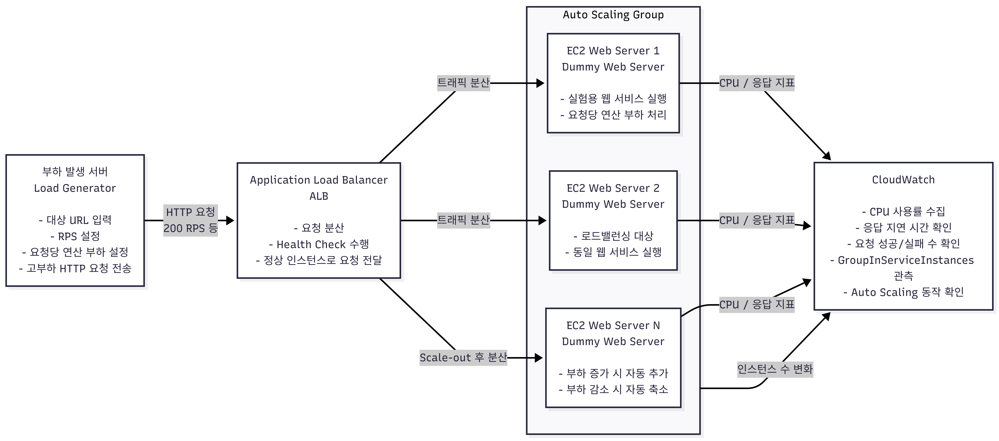
</p>

### 2. 실험 단계 구성

<p align="center">
  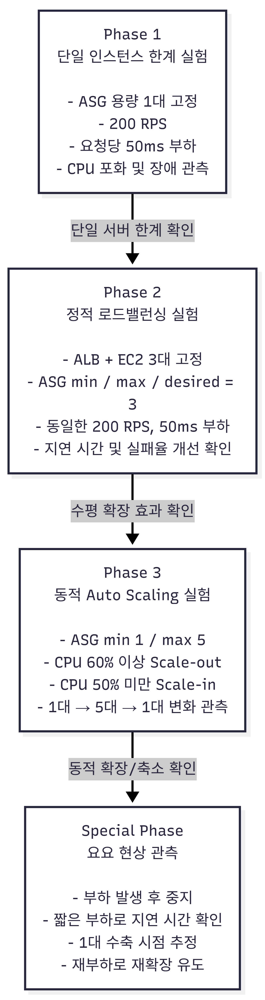
</p>

최종 실험은 Phase 1, Phase 2, Phase 3, Special Phase를 중심으로 진행하였다.

### 3. Phase 1 - 단일 인스턴스 한계 실험

Phase 1에서는 Auto Scaling Group의 용량을 1대로 고정하고, 초당 200개의 요청과 요청당 50ms의 연산 부하를 인가하였다. 이 실험의 목적은 단일 인스턴스 구조에서 고부하 트래픽이 발생했을 때 서버 자원이 얼마나 빠르게 포화되고, 서비스 가용성이 어떻게 저하되는지 확인하는 것이다.

<p align="center">
  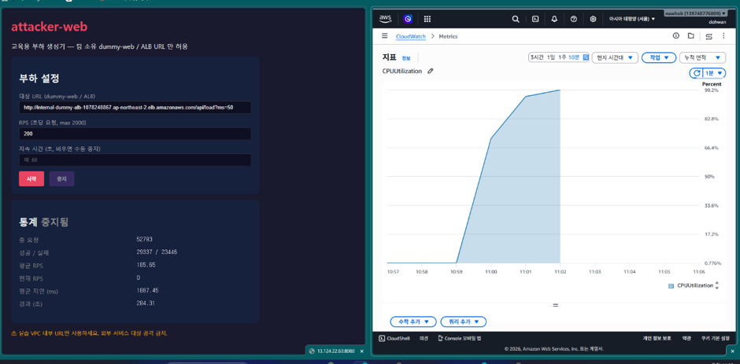
</p>

실험 결과, CPU 사용률은 약 99.2%까지 상승하였다. 전체 요청 수는 52,783건이었고, 이 중 성공 요청은 29,337건, 실패 요청은 23,446건으로 측정되었다. 평균 응답 지연 시간은 1887.45ms였으며, 약 284초 후 인스턴스가 ELB Health Check에 실패하였다.

<p align="center">
  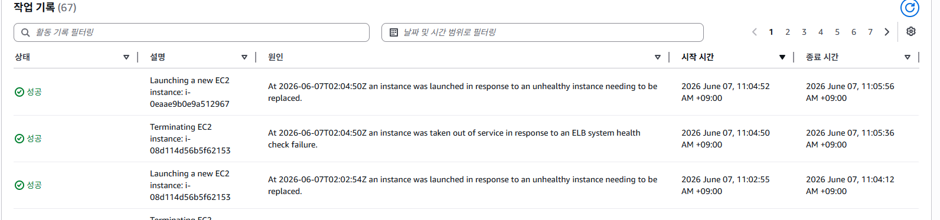
</p>

ASG 작업 기록에서는 기존 인스턴스가 종료되고 새로운 인스턴스가 생성되는 자가 치유 동작이 확인되었다. 이 결과는 단일 인스턴스 구조가 트래픽 폭주 상황에서 CPU 포화, 응답 지연, 오류 증가, Health Check 실패로 이어질 수 있음을 보여준다.

### 4. Phase 2 - 정적 로드밸런싱 실험

Phase 2에서는 ASG의 min, max, desired 값을 모두 3으로 설정하여 EC2 인스턴스 3대가 항상 동작하도록 구성하였다. 이후 Phase 1과 동일하게 200 RPS와 요청당 50ms의 연산 부하를 인가하였다. 이 실험의 목적은 동일한 트래픽을 여러 서버로 분산했을 때 응답 성능과 가용성이 어떻게 개선되는지 확인하는 것이다.

<p align="center">
  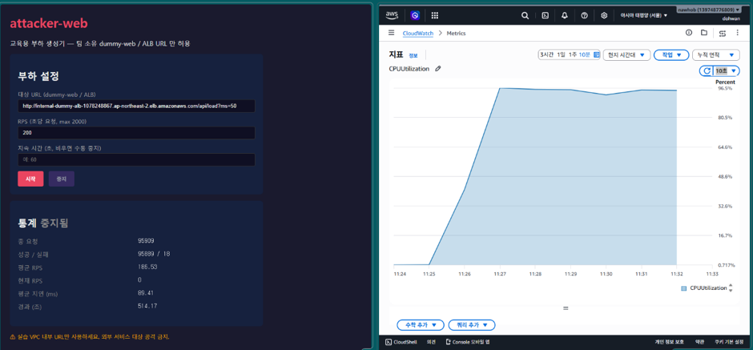
</p>

실험 결과, CPU 사용률은 여전히 높은 수준을 유지했지만 평균 응답 지연 시간은 89.41ms로 크게 감소하였다. 전체 요청 수는 95,909건이었고, 성공 요청은 95,889건, 실패 요청은 18건으로 측정되었다. 실패율은 약 0.02% 수준으로, Phase 1에 비해 매우 크게 감소하였다.

<p align="center">
  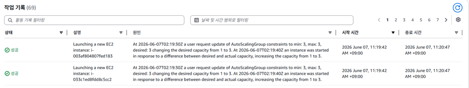
</p>

이 결과는 Application Load Balancer를 통한 수평 확장 구조가 단일 서버 구조보다 고부하 트래픽을 안정적으로 처리할 수 있음을 보여준다. 다만 인스턴스 3대를 항상 유지하는 정적 분산 구조는 트래픽이 낮은 시간에도 서버 비용이 계속 발생한다는 한계가 있다.

### 5. Phase 3 - 동적 Auto Scaling 실험

Phase 3에서는 Auto Scaling Group을 min 1, max 5로 설정하고, CPU 평균 사용률이 60% 이상일 때 인스턴스를 1대 추가하고, 50% 미만일 때 인스턴스를 1대 줄이도록 설정하였다. 쿨다운 시간은 60초로 설정하였다. 부하 조건은 서버 다운을 방지하면서 지속적인 Scale-out을 유도하기 위해 200 RPS, 요청당 30ms 연산 부하로 설정하였다.

<p align="center">
  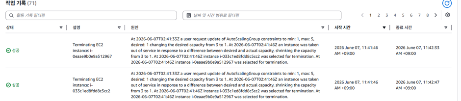
</p>

초기 1대 상태에서는 CPU 사용률이 99%에 근접하고 응답 지연이 크게 증가하였다.

<p align="center">
  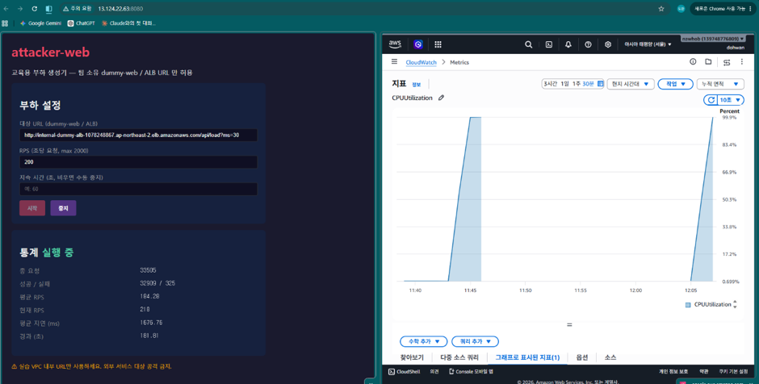
</p>

이후 Auto Scaling 정책이 작동하면서 인스턴스 수가 1대에서 2대, 3대, 4대, 5대까지 계단식으로 증가하였다. 인스턴스가 5대까지 증가한 뒤에는 평균 응답 지연 시간이 약 38.54ms로 안정화되었고, 실패 요청은 0건으로 측정되었다. CPU 사용률은 약 54.6% 수준에서 안정화되었다.

<p align="center">
  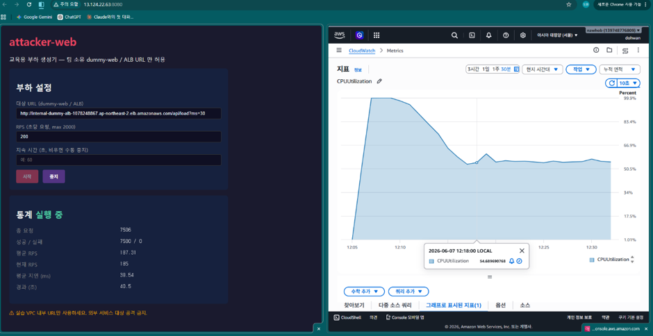
</p>

CloudWatch의 GroupInServiceInstances 지표에서는 인스턴스 수가 1대에서 5대까지 증가하는 Scale-out 과정이 확인되었다.

<p align="center">
  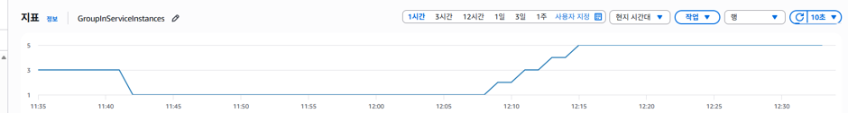
</p>

부하를 중지한 이후에는 인스턴스 수가 5대에서 다시 1대까지 계단식으로 감소하였다. 이를 통해 Auto Scaling이 트래픽 증가 시에는 서버를 자동으로 확장하고, 트래픽 감소 시에는 불필요한 인스턴스를 줄여 비용을 최적화하는 탄력성을 제공함을 확인하였다.

<p align="center">
  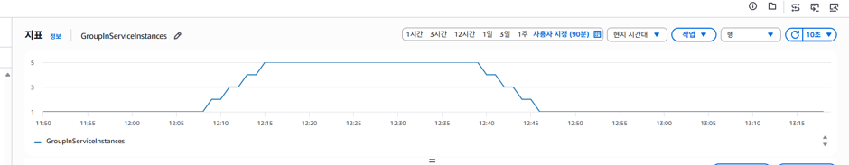
</p>

다만 초기 부하 발생 직후에는 새 인스턴스가 생성되고 ALB에 등록되기까지 시간이 필요하므로, 일정 시간 동안 높은 응답 지연과 일부 실패 요청이 발생할 수 있다. 이 현상은 Scaling Lag로 볼 수 있으며, 실제 서비스 운영에서는 예측 스케일링이나 Target Tracking 정책을 통해 보완할 수 있다.

### 6. Special Phase - 요요 현상 관측 실험

Special Phase에서는 Auto Scaling의 Scale-out과 Scale-in이 반복되면서 인스턴스 수가 증가와 감소를 반복하는 요요 현상을 관측하였다. 실험은 먼저 200 RPS 부하를 발생시켜 인스턴스를 5대까지 확장한 뒤, 부하를 중단하여 Scale-in을 유도하는 방식으로 진행하였다. 이후 짧은 부하를 주기적으로 발생시켜 평균 지연 시간을 확인하고, 인스턴스가 1대로 줄어든 시점을 추정한 뒤 다시 200 RPS 부하를 인가하였다.

<p align="center">
  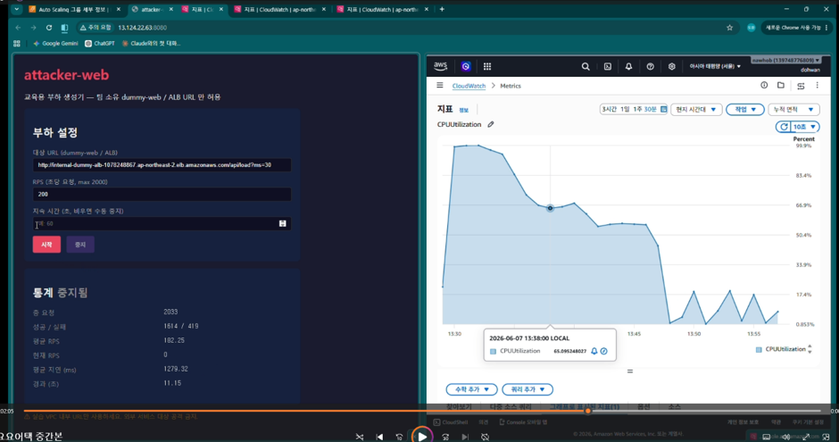
</p>

관측 결과, 5대 확장 상태에서는 평균 지연 시간이 약 38~43ms 수준으로 낮게 유지되었다. 1차 및 2차 짧은 부하에서도 평균 지연 시간이 각각 약 42ms, 43ms 수준으로 측정되어 다수의 인스턴스가 아직 유지되고 있음을 추정할 수 있었다. 그러나 3차 정찰성 부하에서 평균 지연 시간이 약 1270.32ms까지 증가하였고, 이를 통해 인스턴스 수가 1대로 감소한 상태임을 추정하였다.

<p align="center">
  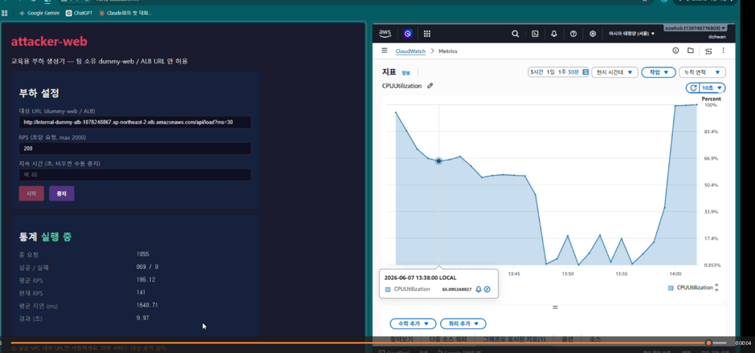
</p>

이후 다시 200 RPS 부하를 인가하자 평균 지연 시간이 약 1640ms 수준으로 증가했고, Auto Scaling이 다시 Scale-out을 수행하였다.

<p align="center">
  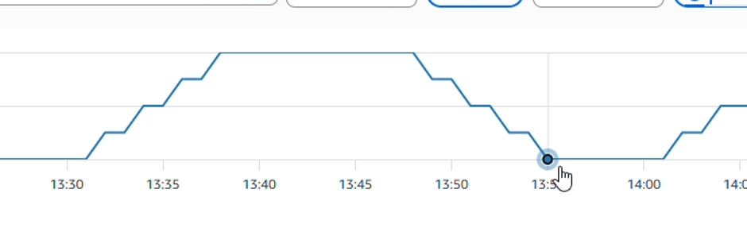
</p>

CloudWatch의 GroupInServiceInstances 그래프에서는 인스턴스 수가 1대에서 5대로 증가했다가 다시 1대로 감소하고, 이후 다시 증가하는 패턴이 관측되었다. 이는 Auto Scaling 정책이 트래픽 변화에 반응하여 정상적으로 동작하고 있음을 보여주는 동시에, 반복적인 부하 변화에 의해 요요 현상이 발생할 수 있음을 보여준다.

이 결과는 Auto Scaling이 비용 최적화와 가용성 확보에 효과적이지만, 임계값과 쿨다운 설정이 단순할 경우 반복적인 확장과 축소로 인해 비용 증가와 일시적 성능 저하가 발생할 수 있음을 시사한다.

---

## G. 개발 결과물을 사용하는 방법 소개

개발 결과물은 AWS 클라우드 환경에서 동작한다. 사용자는 AWS Management Console을 통해 EC2, Application Load Balancer, Auto Scaling Group, CloudWatch를 구성하고, 부하 발생 서버에서 실험 대상 URL로 HTTP 요청을 전송하여 실험을 수행한다.

### 1. 기본 준비 사항

- AWS 계정
- EC2 인스턴스 생성 권한
- Application Load Balancer 생성 권한
- Auto Scaling Group 생성 권한
- CloudWatch 지표 확인 권한
- SSH 접속 환경
- 웹 서버 실행 환경

### 2. 더미 웹 서버 준비

더미 웹 서버는 HTTP 요청을 받으면 정상 응답을 반환하는 실험용 웹 서비스이다. 요청당 연산 부하를 조절하기 위해 `/api/load?ms=50` 또는 `/api/load?ms=30`과 같은 형태의 엔드포인트를 사용한다.

예시 요청은 다음과 같다.

```text
http://<ALB-DNS-NAME>/api/load?ms=50
```

여기서 `ms=50`은 요청당 약 50ms의 연산 부하를 발생시키기 위한 값이다.

### 3. 부하 발생 서버 사용 방법

부하 발생 서버는 웹 UI 형태로 구성되어 있으며, 사용자는 다음 값을 입력하여 부하 테스트를 실행한다.

- 대상 URL: 더미 웹 서버 또는 ALB URL
- RPS: 초당 요청 수
- 지속 시간: 부하를 발생시킬 시간
- 요청당 연산 부하: URL의 `ms` 파라미터로 조절

사용 예시는 다음과 같다.

```text
대상 URL: http://<ALB-DNS-NAME>/api/load?ms=50
RPS: 200
지속 시간: 60초 또는 수동 중지
```

설정 후 시작 버튼을 누르면 부하 발생 서버가 대상 URL로 HTTP 요청을 전송한다. 실험 도중 대시보드에서 총 요청 수, 성공 요청 수, 실패 요청 수, 현재 RPS, 평균 지연 시간 등을 확인할 수 있다.

### 4. Phase별 실행 방법

#### Phase 1 단일 인스턴스 실험

1. Auto Scaling Group의 min, max, desired 값을 모두 1로 설정한다.
2. 부하 발생 서버에서 ALB 또는 단일 웹 서버 URL을 대상으로 설정한다.
3. RPS를 200으로 설정한다.
4. 요청당 연산 부하를 50ms로 설정한다.
5. 부하를 발생시키고 CloudWatch에서 CPU 사용률과 오류 발생 여부를 확인한다.
6. ASG Activity History에서 Health Check 실패 및 인스턴스 교체 여부를 확인한다.

#### Phase 2 정적 로드밸런싱 실험

1. Auto Scaling Group의 min, max, desired 값을 모두 3으로 설정한다.
2. ALB Target Group에 EC2 인스턴스 3대가 정상 등록되었는지 확인한다.
3. Phase 1과 동일한 200 RPS, 50ms 조건으로 부하를 발생시킨다.
4. CloudWatch에서 CPU 사용률, 요청 수, 응답 지연, 오류율을 확인한다.
5. Phase 1 결과와 비교하여 로드밸런싱 효과를 분석한다.

#### Phase 3 동적 Auto Scaling 실험

1. Auto Scaling Group의 min 값을 1, max 값을 5로 설정한다.
2. Scale-out 정책을 CPU 평균 60% 이상일 때 +1대로 설정한다.
3. Scale-in 정책을 CPU 평균 50% 미만일 때 -1대로 설정한다.
4. 쿨다운 시간을 60초로 설정한다.
5. 부하 발생 서버에서 200 RPS, 30ms 조건으로 부하를 발생시킨다.
6. CloudWatch의 `CPUUtilization`과 `GroupInServiceInstances` 지표를 확인한다.
7. 인스턴스 수가 1대에서 5대까지 증가하는지 확인한다.
8. 부하를 중지한 후 인스턴스 수가 다시 1대로 감소하는지 확인한다.

#### Special Phase 요요 현상 관측

1. Phase 3 설정을 유지한다.
2. 200 RPS 부하를 발생시켜 인스턴스 수를 5대까지 증가시킨다.
3. 평균 지연 시간이 낮아지면 부하를 중지한다.
4. 일정 시간 간격으로 짧은 부하를 발생시켜 평균 지연 시간을 확인한다.
5. 평균 지연 시간이 다시 크게 증가하면 인스턴스 수가 1대로 감소한 것으로 추정한다.
6. 다시 200 RPS 부하를 발생시켜 Scale-out을 유도한다.
7. CloudWatch의 `GroupInServiceInstances` 그래프에서 인스턴스 수가 반복적으로 증가하고 감소하는지 확인한다.

---

## H. 개발 결과물의 활용방안 소개

본 프로젝트의 결과물은 클라우드컴퓨팅 수업에서 Load Balancer, Auto Scaling, CloudWatch의 동작 원리를 실습하기 위한 교육용 시스템으로 활용할 수 있다. 단순히 이론으로만 배우는 수평 확장, 부하 분산, 자동 확장, 자가 치유, 탄력성 개념을 실제 AWS 환경에서 직접 확인할 수 있다는 점에서 실습 가치가 있다.

또한 본 시스템은 웹 서비스 운영자가 고부하 트래픽 상황에서 인프라 구성이 서비스 가용성에 어떤 영향을 미치는지 사전에 테스트하는 실험 환경으로도 활용할 수 있다. 단일 서버 구조, 정적 분산 구조, 동적 Auto Scaling 구조를 비교함으로써 서비스 운영 시 어떤 구조가 더 안정적인지 판단하는 기초 자료를 제공할 수 있다.

특히 Auto Scaling 요요 현상 관측 결과는 클라우드 비용 관리 측면에서도 의미가 있다. Auto Scaling은 트래픽 증가 시 가용성을 높이는 장점이 있지만, 부하 변화가 반복될 경우 인스턴스 수가 자주 증가하고 감소하면서 비용 증가와 성능 저하를 유발할 수 있다. 따라서 본 프로젝트 결과는 실제 운영 환경에서 스케일링 임계값, 쿨다운 시간, Scale-in 정책을 신중하게 설정해야 함을 보여준다.

향후에는 AWS WAF Rate-based Rule, CloudFront, AWS Shield, Target Tracking Scaling, Predictive Scaling 등을 추가하여 더 현실적인 DDoS 대응 아키텍처로 확장할 수 있다. 이를 통해 단순한 부하 분산 실험을 넘어, 클라우드 기반 보안 및 가용성 설계 실험 환경으로 발전시킬 수 있다.

---

## I. AI 활용

이번 프로젝트에서 ChatGPT를 활용하여 실험 결과 문장 정리, README.md 초안 작성, 다이어그램 초안 작성, 서버 구축 과정에서의 설정 검토, IAM 권한 설정 및 오류 해결 방향 파악에 도움을 받았다. 특히 Phase별 실험 결과를 보고서 문장으로 정리하고, 전체 시스템 구성도와 실험 단계 다이어그램의 초안을 작성하는 과정에서 AI를 활용하였다.

또한 AWS 서버 구축 과정에서 필요한 구성 흐름을 확인하거나, EC2, ALB, Auto Scaling Group, CloudWatch 사용 과정에서 필요한 IAM 권한과 설정 항목을 검토하는 데 AI의 도움을 받았다. 다만 실제 AWS 인프라 생성, EC2 서버 구축, 더미 웹 서버 실행, 부하 발생 서버 구현, CloudWatch 지표 수집, Auto Scaling 실험 수행 및 결과 캡처는 팀원이 직접 진행하였다.

---

## 참고 파일 구조

```text
repository/
├── README.md
├── report.pdf
├── images/
│   ├── architecture.png
│   ├── phase_flow.png
│   ├── phase1_cpu.png
│   ├── phase1_asg_activity.png
│   ├── phase3_result.png
│   ├── phase3_asg_3_instances.png
│   ├── phase4_settings.png
│   ├── phase4_initial_1_instance.png
│   ├── phase4_stable_5_instances.png
│   ├── phase4_scale_out_graph.png
│   ├── phase4_scale_in_graph.png
│   ├── yoyo_latency_probe.png
│   ├── yoyo_reattack.png
│   └── yoyo_graph.png
└──  기타 코드 파일
```
