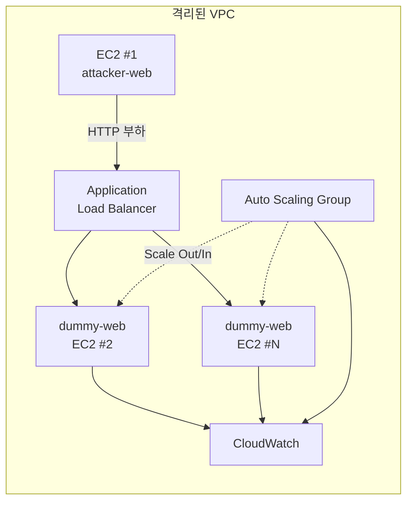

# Cloud Computing Term Project — 최종 보고서

---

## A. 프로젝트 명

**DDoS 부하 실험 및 오토스케일링 관측 실습 환경**  
*(CloudComputingTermProject)*

---

## B. 프로젝트 멤버 및 담당 파트

| 멤버 | 담당 파트 |
|------|-----------|
| Blueapple031 | 프로젝트 기획·개발 계획서 작성, `dummy-web` / `attacker-web` 애플리케이션 개발, Docker·CI/CD 파이프라인 구성, EC2 배포 스크립트·문서 작성, 실험 시나리오 설계, 최종 보고서 작성 |

> 팀 구성원이 추가된 경우 위 표에 이름과 담당 파트를 보완해 주세요.

---

## C. 프로젝트 소개

본 프로젝트는 **클라우드 컴퓨팅** 수업의 term project로, AWS EC2 기반 격리 환경에서 **DDoS(분산 서비스 거부) 유형의 부하**가 웹 서버에 미치는 영향을 직접 관측하고, **로드밸런싱·오토스케일링** 적용 시 시스템 탄력성과 **요요(Yo-Yo) 현상**을 실험·분석하기 위한 **교육용 실습 플랫폼**을 구축한다.

핵심 구성은 두 개의 마이크로서비스다.

| 서비스 | 배치 | 역할 |
|--------|------|------|
| **attacker-web** | EC2 #1 (포트 8080) | RPS·지속 시간을 설정하고 HTTP 부하를 생성하는 실험 제어 UI/API |
| **dummy-web** | EC2 #2 (포트 8000) | 부하를 수신하는 타깃 서버. CPU·메모리·요청 통계를 실시간 노출 |

Attacker EC2에서 Dummy EC2로만 제어된 트래픽을 발생시키며, **외부 서비스 공격 기능은 구현하지 않는다.** Phase 2에서는 Application Load Balancer(ALB)와 Auto Scaling Group(ASG)을 앞단에 추가해 스케일 아웃/인 및 요요 현상 실험을 확장할 수 있다.

---

## D. 프로젝트 필요성

### 1. 이론과 실습의 간극

클라우드·DDoS·오토스케일링은 교과서와 강의로는 개념을 익히기 쉽지만, **CPU 급등, RPS 임계점, 스케일 아웃 지연, 인스턴스 수 진동** 같은 현상은 실제 환경에서 트래픽을 발생시켜 봐야 체감할 수 있다. 본 프로젝트는 그 간극을 메우는 **재현 가능한 실습 샌드박스**를 제공한다.

### 2. 안전한 실험 환경

실제 DDoS 공격 도구를 사용하면 법적·윤리적 문제가 발생한다. 팀이 소유한 VPC 내부 EC2끼리만 통신하도록 설계하고, attacker-web은 **URL 화이트리스트**로 대상을 제한하여 **교육 목적의 합법적·통제된 실험**만 가능하게 한다.

### 3. 클라우드 탄력성 검증

단일 EC2의 한계(RPS·CPU 임계점)를 측정한 뒤, ALB·ASG를 도입했을 때 **처리량·복구 시간·비용·요요 현상**이 어떻게 달라지는지 정량적으로 비교할 수 있다. 이는 AWS Well-Architected Framework의 **탄력성(Reliability)** 원칙을 실습으로 연결한다.

### 4. 운영·DevOps 역량

Docker 컨테이너화, GitHub Actions CI, EC2 배포 자동화 등 **현업과 유사한 배포 파이프라인**을 경험함으로써, 단순 코딩을 넘어 클라우드 네이티브 운영 역량을 기른다.

---

## E. 관련 기술 / 논문 / 특허 조사

### 1. 관련 기술

| 영역 | 기술·서비스 | 본 프로젝트 적용 |
|------|-------------|------------------|
| 클라우드 | AWS EC2, VPC, Security Group | Phase 1: EC2 2대 격리 배치 |
| 부하 생성 | Python FastAPI, asyncio, aiohttp | attacker-web 비동기 HTTP 부하 |
| 타깃 서버 | Python FastAPI, psutil | dummy-web CPU 바운드 `/api/load`, 메트릭 API |
| 컨테이너 | Docker, Docker Compose | 로컬·EC2 동일 실행 환경 |
| CI/CD | GitHub Actions | PR/push 시 pytest + Docker build |
| 모니터링 | CloudWatch (Phase 2), psutil (앱 내) | CPU·Network·응답 시간 관측 |
| 확장 (Phase 2) | ALB, ASG, Launch Template | 로드 분산·자동 스케일링·요요 실험 |

### 2. 참고 논문·문헌

| 구분 | 출처 | 핵심 내용 |
|------|------|-----------|
| 표준 | NIST SP 800-189, *Resilience of Internet Infrastructure* | DDoS 위협 분류, 완화·복원력 권고 — 실습 환경의 **격리·접근 통제** 설계 근거 |
| 논문 | Quan et al., *Adaptive Scaling of Cloud Resources* (IEEE Cloud Computing, 2019) | CPU 기반 오토스케일링 정책과 **스케일링 진동(oscillation)** — 요요 현상 분석 프레임 |
| 논문 | Gandhi et al., *AutoScale: Dynamic, Robust Capacity Management for Multi-Tier Data Centers* (ACM TOS, 2012) | 다계층 서비스의 **동적 용량 관리** — ASG Target Tracking 정책 이해 |
| 기술 문서 | AWS Auto Scaling User Guide | Scale Out/In, Cooldown, Target Tracking — Phase 2 실험(E5~E7) 설계 참고 |
| 기술 문서 | AWS Application Load Balancer Developer Guide | 헬스체크, Target Group — LB 실험(E4) 구성 |
| 특허 | US 9,832,031 B2 (Amazon), *Managing auto scaling groups* | ASG 기반 자동 증감 메커니즘 — 클라우드 오토스케일링 상용 구현 사례 |

### 3. 조사 요약

DDoS는 **가용성(Availability)** 을 침해하는 대표적 위협이며, 클라우드에서는 **수평 확장(Scale Out)** 과 **로드밸런싱**으로 완화한다. 다만 Scale Out/In 임계값·Cooldown 설정이 부적절하면 CPU가 임계값 근처에서 반복 진동하며 **요요 현상**이 발생한다. 본 프로젝트는 이러한 이론을 **attacker-web → dummy-web** 제어 트래픽으로 재현하고, Phase 2에서 ALB·ASG를 통해 정책 튜닝 실험까지 확장할 수 있도록 설계했다.

---

## F. 프로젝트 개발 결과물 (+ 다이어그램)

### 1. 산출물 목록

| 구분 | 경로 / 산출물 | 설명 |
|------|---------------|------|
| 부하 생성기 | `services/attacker-web/` | RPS 설정, 시작/중지 UI, REST API, URL 화이트리스트 |
| 타깃 서버 | `services/dummy-web/` | `/api/load`(CPU 부하), `/api/db-sim`, `/api/metrics`, 대시보드 |
| 로컬 실행 | `deploy/docker-compose.yml` | 두 서비스 동시 기동 (Phase 1 흐름 재현) |
| EC2 배포 | `services/*/deploy/`, `infra/scripts/bootstrap-ec2.sh` | Docker 기반 git-pull / ECR 배포 |
| CI | `.github/workflows/ci.yml` | pytest + Docker build 검증 |
| 계획·설계 | `개발계획서.md` | 아키텍처, 실험 시나리오(E1~E7), 일정 |

### 2. Phase 1 시스템 구성도

```
┌──────────────────────────────────────────────────────────────┐
│                    격리된 VPC (실습 전용)                       │
│                                                              │
│   ┌─────────────────────────┐    HTTP 부하    ┌────────────┐ │
│   │  EC2 #1 — Attacker      │ ──────────────► │ EC2 #2 —   │ │
│   │  attacker-web :8080     │                 │ dummy-web  │ │
│   │  - RPS / 지속시간 UI    │                 │ :8000      │ │
│   │  - /api/load/start|stop │                 │ - /api/load│ │
│   └─────────────────────────┘                 │ - /api/metrics
│                                               └─────┬──────┘ │
│                                                     │        │
│                                                     ▼        │
│                              ┌──────────────────────────┐   │
│                              │  CloudWatch (양쪽 EC2)    │   │
│                              └──────────────────────────┘   │
└──────────────────────────────────────────────────────────────┘
```

### 3. Phase 2 확장 구성도 (계획)



### 4. 주요 API

**attacker-web**

| 메서드 | 경로 | 설명 |
|--------|------|------|
| GET | `/` | 부하 실험 제어 웹 UI |
| GET | `/health` | 헬스체크 |
| GET | `/api/load/status` | 부하 통계 (RPS, latency, 성공/실패) |
| POST | `/api/load/start` | 부하 시작 (`rps`, `duration_sec`, `target_url`) |
| POST | `/api/load/stop` | 부하 중지 |

**dummy-web**

| 메서드 | 경로 | 설명 |
|--------|------|------|
| GET | `/` | CPU·메모리 실시간 대시보드 |
| GET | `/health` | 헬스체크 |
| GET | `/api/load?ms=` | CPU 바운드 연산 (부하 수신) |
| GET | `/api/db-sim?delay_ms=` | I/O 지연 시뮬레이션 |
| GET | `/api/metrics` | CPU·메모리·요청 통계 JSON |

### 5. 실험 시나리오 (개발계획서 기준)

| ID | 시나리오 | 목적 |
|----|----------|------|
| E1 | 베이스라인 | 단일 dummy-web 임계 RPS 측정 |
| E2 | 지속 부하 | 장시간 CPU·응답 시간 drift 관측 |
| E3 | Step 부하 | RPS 단계 증가 → p95 latency 곡선 |
| E4 | LB만 적용 | ALB 경유 오버헤드 (Phase 2) |
| E5 | ASG Scale Out | 스케일 아웃 반응 속도 (Phase 2) |
| E6 | 요요 현상 유발 | 인스턴스 수 진동 패턴 (Phase 2) |
| E7 | 정책 튜닝 | Cooldown·임계값 조정으로 요요 완화 (Phase 2) |

---

## G. 개발 결과물 사용 방법

### 1. 사전 요구사항

- Docker Desktop (또는 Docker Engine + Compose plugin)
- Python 3.12 (로컬 테스트 시)
- AWS 계정, EC2 2대 (클라우드 배포 시)

### 2. 로컬 실행 (Docker Compose)

프로젝트 루트에서:

```bash
docker compose -f deploy/docker-compose.yml up --build
```

| URL | 용도 |
|-----|------|
| http://localhost:8080 | attacker-web — RPS 설정 후 **시작** 클릭 |
| http://localhost:8000 | dummy-web — CPU·메모리 대시보드 |
| http://localhost:8000/api/metrics | JSON 메트릭 (CloudWatch 대조용) |

**동작 순서**

1. dummy-web이 healthy 상태가 되면 attacker-web이 기동된다.
2. attacker UI에서 대상 URL(기본: `http://dummy-web:8000/api/load?ms=100`), RPS, 지속 시간을 입력한다.
3. **시작** → dummy-web CPU 상승, `/api/metrics`의 `cpu_percent` 증가를 확인한다.
4. **중지** → 부하 종료.

### 3. 로컬 단위 테스트

```bash
cd services/dummy-web
pip install -r requirements.txt -r requirements-dev.txt
pytest -v

cd ../attacker-web
pip install -r requirements.txt -r requirements-dev.txt
pytest -v
```

### 4. EC2 배포 (Ubuntu)

**Phase 1 권장 흐름 — git pull 배포 (ECR 없이)**

1. EC2 #2 (dummy-web)에 Docker 설치: `sudo bash infra/scripts/bootstrap-ec2.sh dummy`
2. EC2 #1 (attacker-web): `sudo bash infra/scripts/bootstrap-ec2.sh attacker`
3. 각 EC2에서 레포 clone 후 `services/<서비스>/deploy/git-deploy.sh` 실행
4. Security Group: Attacker → Dummy **8000** 포트만 허용
5. attacker-web 환경변수 `TARGET_URL=http://<dummy-private-ip>:8000/api/load?ms=100` 설정

**ECR + GitHub Actions 배포**

- `.github/workflows/deploy-dummy.yml`, `deploy-attacker.yml` — 해당 서비스 경로 변경 시 EC2 SSH 배포
- Secrets: `AWS_ACCESS_KEY_ID`, `DUMMY_EC2_HOST`, `ATTACKER_EC2_HOST`, `EC2_SSH_PRIVATE_KEY` 등

### 5. 환경 변수 (주요)

**attacker-web**

| 변수 | 설명 | 예시 |
|------|------|------|
| `TARGET_URL` | 기본 부하 대상 | `http://dummy-web:8000/api/load?ms=100` |
| `ALLOWED_TARGET_HOSTS` | 허용 호스트 (쉼표 구분) | `dummy-web,localhost,10.0.1.5` |
| `MAX_RPS` | RPS 상한 | `5000` |

**dummy-web**

| 변수 | 설명 | 예시 |
|------|------|------|
| `INSTANCE_ID` | 인스턴스 식별 (LB 실험용) | `i-0abc123` |
| `DEFAULT_LOAD_MS` | `/api/load` 기본 연산 시간(ms) | `100` |

---

## H. 개발 결과물 활용 방안

### 1. 클라우드 컴퓨팅 교육

- **DDoS 영향 시연**: RPS를 올리며 CPU·latency·에러율 변화를 실시간으로 보여주는 데모
- **오토스케일링 실습**: Phase 2 ALB·ASG 연동 후 Scale Out/In, 요요 현상 실험 및 보고서 작성

### 2. 성능·용량 계획(Capacity Planning)

- E1~E3 실험으로 **단일 인스턴스 처리 한계(RPS)** 를 측정하고, ASG `max`·인스턴스 타입 선정의 근거 데이터로 활용

### 3. DevOps·SRE 학습

- Docker + CI 파이프라인을 템플릿으로 재사용해 다른 마이크로서비스 실습 확장
- CloudWatch 대시보드·알람 연동으로 **SRE 관측성(Observability)** 실습

### 4. 보안·윤리 교육

- URL 화이트리스트, VPC 격리, SG 최소 권한 설계를 사례로 **Responsible Disclosure·합법적 테스트** 원칙 교육

### 5. 연구·졸업 프로젝트 확장

- ramp-up/down 부하 패턴, `db-sim` 엔드포인트를 활용한 **I/O bound vs CPU bound** 비교
- Kubernetes HPA, Serverless(AWS Lambda)와 ASG 정책 비교 실험

---

## I. AI 활용

### 사용 AI

| AI 도구 | 활용 내용 |
|---------|-----------|
| **Cursor Agent (Composer)** | 개발 계획서 초안, `dummy-web`·`attacker-web` 전체 코드, Dockerfile, docker-compose, GitHub Actions CI, EC2 bootstrap·배포 스크립트, README·배포 문서 작성 |
| **Cursor Chat** | 아키텍처 검토, Docker/EC2 배포 절차 Q&A, 코드 동작 설명 |

### AI 기여 비율 (추정)

| 영역 | AI 기여 | 사람 기여 |
|------|---------|-----------|
| 애플리케이션 코드 (Python, HTML, Shell) | **약 85%** | 요구사항 정의, 실험 시나리오·아키텍처 결정, 로컬·Docker 검증, 수정 지시 |
| 인프라·CI 설정 | **약 80%** | AWS 리소스 생성, Secrets·EC2 IP 등 환경별 값 설정 |
| 문서 (개발계획서, README) | **약 90%** | 프로젝트 목표·실험 의도 제시, 최종 검토 |

**전체 프로젝트 코드·설정·문서 기준 AI 작성 비율: 약 85%**

- AI가 생성한 코드는 **사람이 로컬 Docker Compose 실행, pytest, EC2 배포 테스트**로 검증·수정했다.
- 핵심 설계(교육용 격리, URL 화이트리스트, EC2 2대 1:1 배치, Phase 1/2 분리)는 사람이 방향을 제시하고 AI가 구현했다.

---

## 저장소 빠른 참조

| 항목 | 내용 |
|------|------|
| 로컬 실행 | `docker compose -f deploy/docker-compose.yml up --build` |
| Attacker UI | http://localhost:8080 |
| Dummy 대시보드 | http://localhost:8000 |
| 상세 설계 | [개발계획서.md](./개발계획서.md) |
